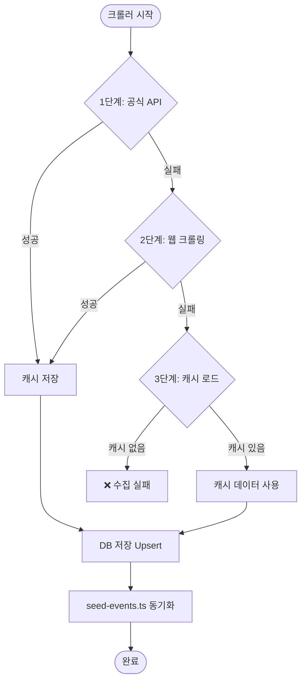

# 🕷️ 크롤러 시스템 (Crawler System)

> Certi-Hub 크롤러의 3단계 Fallback 전략, 크롤러 종류, 실행 방법, 운영 가이드를 정리합니다.
>
> 📍 소스 위치: `backend/crawlers/`

---

## 🏗️ 시스템 개요

Certi-Hub 크롤러는 다양한 외부 소스(공공데이터 API, 자격증 기관 웹사이트)에서 시험 일정 및 자격증 정보를 자동으로 수집하여 데이터베이스에 저장합니다. **3단계 Fallback 전략**을 통해 어떤 상황에서도 최신 데이터를 제공할 수 있도록 설계되었습니다.



---

## 🎯 3단계 Fallback 전략

모든 크롤러는 `BaseScraper` 클래스를 상속하며, 동일한 3단계 전략을 따릅니다.

### 1단계: 공식 API 호출 (`try_official_api`)

| 항목 | 설명 |
|------|------|
| **방법** | 공식 Open API (REST) 호출 |
| **장점** | 가장 정확하고 구조화된 데이터 |
| **단점** | API Key 필요, API 스펙 변경 가능성 |
| **예시** | 공공데이터포털(data.go.kr) Q-Net API, AWS Certification API |

### 2단계: 웹 크롤링 (`try_web_scraping`)

| 항목 | 설명 |
|------|------|
| **방법** | HTML 페이지 파싱 (httpx + BeautifulSoup) |
| **장점** | API 없이도 데이터 수집 가능 |
| **단점** | 웹페이지 구조 변경에 취약 |
| **예시** | Q-Net 시험일정 페이지 테이블 파싱, KData 웹페이지 파싱 |

### 3단계: 캐시 데이터 (`load_cache`)

| 항목 | 설명 |
|------|------|
| **방법** | 마지막 성공 시 저장된 JSON 캐시 파일 로드 |
| **장점** | 외부 서비스 장애 시에도 서비스 연속성 보장 |
| **단점** | 데이터가 구버전일 수 있음 |
| **저장 위치** | `/app/cache/{source}_schedules.json` |

> 💡 **핵심 원칙**: 1단계 또는 2단계 성공 시 반드시 캐시를 갱신하여, 다음 번 3단계 시 최신 데이터를 사용할 수 있도록 합니다.

---

## 🕷️ 크롤러 목록

| 크롤러 | 클래스 | 소스 이름 | 대상 |
|--------|--------|-----------|------|
| **Q-Net** | `QNetScraper` | `qnet` | 국가기술자격 (정보처리기사, 정보보안기사 등) |
| **KData** | `KDataScraper` | `kdata` | 데이터 자격시험 (SQLD, SQLP, DAP, DAsP) |
| **Cloud** | `CloudScraper` | `cloud` | 클라우드 벤더 자격증 (AWS, GCP, Azure) |
| **Finance** | `FinanceScraper` | `finance` | 금융 자격증 (KOFIA, KBI, FPKOREA) |
| **IT Domestic** | `ITDomesticScraper` | `it_domestic` | 국내 IT 자격증 (ICQA, IHD, KSTQB 등) |
| **Intl Cert** | `IntlCertScraper` | `intl` | 국제 CBT 자격증 (ISC2, Cisco, Oracle, PMI 등) |

---

## 📋 크롤러별 상세

### 1. Q-Net 크롤러 (`qnet_scraper.py`)

국가기술자격 시험 일정을 수집합니다.

| 단계 | 소스 | 설명 |
|------|------|------|
| 1단계 | 공공데이터포털 API | `data.go.kr` Q-Net 시험일정 API (`DATA_GO_KR_API_KEY` 필요) |
| 2단계 | Q-Net 웹크롤링 | `q-net.or.kr` 시험일정 페이지 테이블 파싱 |
| 2-1 | Known 일정 | 웹 파싱 실패 시 수동 입력된 공개 일정 데이터 사용 |
| 3단계 | 캐시 | 마지막 성공 데이터 |

**환경변수**: `DATA_GO_KR_API_KEY` — [공공데이터포털](https://www.data.go.kr)에서 무료 발급

**주요 대상 자격증**:
- 정보처리기사 / 산업기사
- 정보보안기사 / 산업기사
- 빅데이터분석기사
- 정보통신기사
- 컴퓨터활용능력 1급
- 서비스경험디자인기사

---

### 2. KData 크롤러 (`kdata_scraper.py`)

데이터 관련 자격시험 일정을 수집합니다.

| 단계 | 소스 | 설명 |
|------|------|------|
| 1단계 | KData API | `dataq.or.kr` 시험일정 API/AJAX |
| 2단계 | KData 웹크롤링 | 웹페이지 파싱 |
| 3단계 | 캐시 | 마지막 성공 데이터 |

**주요 대상**: SQLD, SQLP, DAP, DAsP, ADP

---

### 3. Cloud 크롤러 (`cloud_scraper.py`)

클라우드 벤더 자격증 정보를 업데이트합니다.

| 단계 | 소스 | 설명 |
|------|------|------|
| 1단계 | 벤더 공식 API | AWS Certification API, Azure/MS Learn API |
| 2단계 | URL 유효성 확인 | 각 자격증 공식 페이지 HTTP HEAD 요청 |
| 3단계 | 캐시 | 마지막 성공 데이터 |

**특이사항**:
- 클라우드 자격증은 **상시 접수** → 시험 일정 INSERT가 아닌 **URL + `updated_at` 갱신**에 초점
- 커스텀 `save_to_db()` 메서드 사용 (부모 클래스와 다른 로직)

**대상 벤더 및 자격증**:
- **AWS**: CLF-C02, SAA-C03, DVA-C02, SAP-C02
- **GCP**: ACE, PCA, PDE, PCSE
- **Azure**: AZ-900, AZ-104, AZ-305, AZ-204

---

### 4. Finance 크롤러 (`finance_scraper.py`)

금융 분야 자격증 일정을 수집합니다.

| 단계 | 소스 | 설명 |
|------|------|------|
| 1단계 | AJAX API | KOFIA/KBI/FPKOREA AJAX 요청 |
| 2단계 | 웹크롤링 | 각 기관 웹페이지 파싱 |
| 3단계 | 캐시 | 마지막 성공 데이터 |

**주요 대상**: 펀드투자권유자문인력, 투자자산운용사, CFP, AFPK

---

### 5. IT Domestic 크롤러 (`it_domestic_scraper.py`)

국내 IT 자격증 일정을 수집합니다.

| 단계 | 소스 | 설명 |
|------|------|------|
| 1단계 | 기관 API/웹 | ICQA/IHD/KSTQB/상공회의소 |
| 2단계 | 웹크롤링 | 각 기관 시험일정 페이지 |
| 3단계 | 캐시 | 마지막 성공 데이터 |

**주요 대상**: 네트워크관리사, 리눅스마스터, ISTQB/KSTQB, 전자상거래관리사

---

### 6. Intl Cert 크롤러 (`intl_cert_scraper.py`)

국제 CBT 자격증 정보를 업데이트합니다.

| 단계 | 소스 | 설명 |
|------|------|------|
| 1단계 | 벤더 API | ISC2/Cisco/Oracle/PMI 공식 API |
| 2단계 | URL 유효성 확인 | 공식 페이지 접근 가능 여부 확인 |
| 3단계 | 캐시 | 마지막 성공 데이터 |

**주요 대상**: CISSP, CCNA, CCNP, OCA, OCP, PMP, CAPM

---

## ⚙️ 핵심 구성 요소

### `BaseScraper` (추상 베이스 클래스)

모든 크롤러의 부모 클래스로, 3단계 Fallback 전략을 강제합니다.

```python
class BaseScraper(ABC):
    source_name: str = "base"

    def fetch_schedules(self) -> List[Dict]:
        """3단계 Fallback 순차 실행"""
        # 1단계 → 2단계 → 3단계

    @abstractmethod
    def try_official_api(self) -> List[Dict]: ...
    @abstractmethod
    def try_web_scraping(self) -> List[Dict]: ...

    def save_to_db(self) -> Dict:
        """수집 데이터를 DB에 Upsert"""

    @abstractmethod
    def close(self): ...
```

### DB 헬퍼 함수

| 함수 | 설명 |
|------|------|
| `get_sync_engine()` | 동기 DB 엔진 싱글턴 (크롤러용, `@lru_cache`) |
| `find_cert_id(session, name_ko)` | 자격증 이름(정확일치)으로 UUID 조회 |
| `find_cert_id_like(session, keyword)` | 자격증 이름(부분일치 ILIKE)으로 UUID 조회 |
| `upsert_schedule(...)` | 시험 일정 Upsert (`cert_id + round` 중복 확인) |
| `parse_date(date_str)` | 다양한 형식의 날짜 문자열 파싱 |

### 캐시 유틸리티

| 함수 | 설명 |
|------|------|
| `save_cache(source, data)` | 성공 데이터를 JSON 파일로 저장 |
| `load_cache(source)` | 마지막 성공 캐시 JSON 로드 |

**캐시 파일 형식**:
```json
{
  "fetched_at": "2026-02-09T03:01:30",
  "source": "qnet",
  "count": 12,
  "schedules": [
    {
      "cert_name": "정보처리기사",
      "round": 1,
      "reg_start": "2026-01-13",
      "reg_end": "2026-01-16",
      "exam_date": "2026-02-22",
      "result_date": "2026-03-20"
    }
  ]
}
```

---

## 🔄 Upsert (Conflict Resolution) 전략

크롤러의 `upsert_schedule` 함수는 다음 규칙을 따릅니다:

1. **`cert_id` + `round`** 조합으로 기존 데이터 존재 여부 확인
2. **기존 데이터 있으면** → `COALESCE`로 NULL이 아닌 값만 업데이트 + `updated_at` 갱신
3. **기존 데이터 없으면** → 새로 INSERT

```sql
-- 기존 데이터 업데이트 (NULL이 아닌 값만)
UPDATE exam_schedules
SET reg_start = COALESCE(:rs, reg_start),
    reg_end = COALESCE(:re, reg_end),
    exam_date = COALESCE(:ed, exam_date),
    result_date = COALESCE(:rd, result_date),
    updated_at = NOW()
WHERE cert_id = :cid AND round = :r
```

---

## 🚀 실행 방법

### CLI 직접 실행

```bash
cd backend

# 전체 크롤러 실행
python -m crawlers.run_crawlers

# 개별 크롤러 실행
python -m crawlers.run_crawlers --qnet        # Q-Net만
python -m crawlers.run_crawlers --kdata       # KData만
python -m crawlers.run_crawlers --cloud       # Cloud만
python -m crawlers.run_crawlers --finance     # 금융만
python -m crawlers.run_crawlers --itdomestic  # 국내 IT만
python -m crawlers.run_crawlers --intl        # 국제 CBT만
```

### API를 통한 수동 실행

```bash
# 전체 크롤링
curl -X POST http://localhost:8000/api/crawl/trigger

# 특정 소스만
curl -X POST "http://localhost:8000/api/crawl/trigger?source=qnet"
```

### 자동 스케줄링 (APScheduler)

`backend/services/scheduler.py`에서 APScheduler로 정기 실행을 관리합니다:

- **실행 주기**: 매일 새벽 3시 (KST)
- **실행 내용**: 전체 크롤러 순차 실행 → seed-events.ts 동기화
- **에러 처리**: 개별 크롤러 실패 시 다음 크롤러는 계속 실행

```python
# scheduler.py 에서의 설정 (예시)
scheduler.add_job(
    run_crawl_job,
    trigger=CronTrigger(hour=3, minute=0, timezone="Asia/Seoul"),
    id="daily_crawl",
    name="일일 크롤링",
    replace_existing=True,
)
```

---

## 📊 실행 결과 모니터링

### 로그 출력 형식

```
============================================================
📊 크롤링 완료 요약 - 2026-02-09 03:05:30
============================================================
  ✅ Q-Net: success (12.5s) — 🟢 공식 API
       매칭: 12, 신규: 3, 업데이트: 5, 건너뜀: 0
  ✅ KData: success (5.3s) — 🟡 웹 크롤링
       매칭: 4, 신규: 0, 업데이트: 4, 건너뜀: 0
  ✅ Cloud: success (8.1s) — 🟠 캐시 데이터
       매칭: 12, 업데이트: 10, 건너뜀: 2
  ❌ Finance: failed (2.0s) — 🔴 실패
       에러: Connection timeout
  ✅ IT Domestic: success (6.2s) — 🟢 공식 API
       매칭: 8, 신규: 1, 업데이트: 7, 건너뜀: 0
  ✅ Intl Cert: success (4.5s) — 🟡 웹 크롤링
       매칭: 15, 업데이트: 15, 건너뜀: 0
------------------------------------------------------------
  📈 합계 — 신규: 4, 업데이트: 41, 건너뜀: 2
============================================================
```

### 수집 방법 라벨

| 라벨 | 의미 |
|------|------|
| 🟢 공식 API | 1단계 API 성공 |
| 🟡 웹 크롤링 | 2단계 크롤링 성공 |
| 🟠 캐시 데이터 | 3단계 캐시 사용 |
| 🔴 실패 | 모든 단계 실패 |
| ⚪ 미실행 | 실행되지 않음 |

### API로 상태 확인

```bash
# 크롤링 상태 요약
curl http://localhost:8000/api/crawl/status

# 최근 이력 조회
curl http://localhost:8000/api/crawl/logs?limit=10

# 통계 요약
curl http://localhost:8000/api/crawl/stats
```

---

## 🔧 seed-events.ts 자동 동기화

크롤링 완료 후, DB의 시험 일정 데이터를 `frontend/lib/seed-events.ts` 파일로 자동 동기화합니다.

**목적**: 백엔드 API가 다운되어도 프론트엔드가 정적 데이터로 서비스를 제공할 수 있도록 보장

**동기화 흐름**:
1. 크롤링 완료
2. DB에서 전체 시험 일정 조회
3. FullCalendar 이벤트 형식으로 변환
4. `frontend/lib/seed-events.ts`에 TypeScript 배열로 기록

```bash
# 수동 동기화
curl -X POST http://localhost:8000/api/crawl/sync-seed
```

---

## 🛠️ 새 크롤러 추가 가이드

### 1. 크롤러 파일 생성

`backend/crawlers/` 에 새 파일을 생성합니다:

```python
# backend/crawlers/new_scraper.py

from crawlers.base import BaseScraper
from typing import List, Dict

class NewScraper(BaseScraper):
    source_name = "new_source"  # 고유 이름

    def try_official_api(self) -> List[Dict]:
        """1단계: API 호출"""
        # 구현...
        return []

    def try_web_scraping(self) -> List[Dict]:
        """2단계: 웹 크롤링"""
        # 구현...
        return []

    def close(self):
        """리소스 정리"""
        pass
```

### 2. 반환 데이터 형식

```python
{
    "cert_name": "자격증 국문명",  # certifications.name_ko와 매칭
    "round": 1,                    # 시험 회차
    "reg_start": "2026-03-01",     # 접수 시작일
    "reg_end": "2026-03-15",       # 접수 마감일
    "exam_date": "2026-04-20",     # 시험일
    "result_date": "2026-05-10",   # 발표일
}
```

### 3. 오케스트레이터에 등록

`backend/crawlers/run_crawlers.py`에 실행 함수 추가:

```python
def run_new_source():
    from crawlers.new_scraper import NewScraper
    scraper = NewScraper()
    try:
        stats = scraper.save_to_db()
        return {"name": "New Source", "status": "success", "stats": stats}
    except Exception as e:
        return {"name": "New Source", "status": "failed", "error": str(e)}
    finally:
        scraper.close()
```

### 4. DB에 자격증 마스터 데이터 추가

`database/seed.sql`에 새 자격증을 추가하여 `find_cert_id()`가 매칭할 수 있도록 합니다.

---

## 📁 파일 구조

```
backend/crawlers/
├── __init__.py
├── base.py                  # BaseScraper + DB 헬퍼 + 캐시 유틸
├── qnet_scraper.py          # Q-Net (국가기술자격)
├── kdata_scraper.py         # KData (데이터 자격시험)
├── cloud_scraper.py         # Cloud (AWS/GCP/Azure)
├── finance_scraper.py       # Finance (금융 자격증)
├── it_domestic_scraper.py   # IT Domestic (국내 IT)
├── intl_cert_scraper.py     # Intl Cert (국제 CBT)
└── run_crawlers.py          # 오케스트레이터 (전체 실행 + 요약)
```

---

## 🔗 관련 문서

| 문서 | 설명 |
|------|------|
| [서비스 개요](./service-overview.md) | 서비스 소개 |
| [아키텍처](./architecture.md) | 시스템 구조 |
| [API 명세](./api-reference.md) | 크롤링 관리 API |
| [데이터베이스 스키마](./database-schema.md) | 테이블 구조 |
