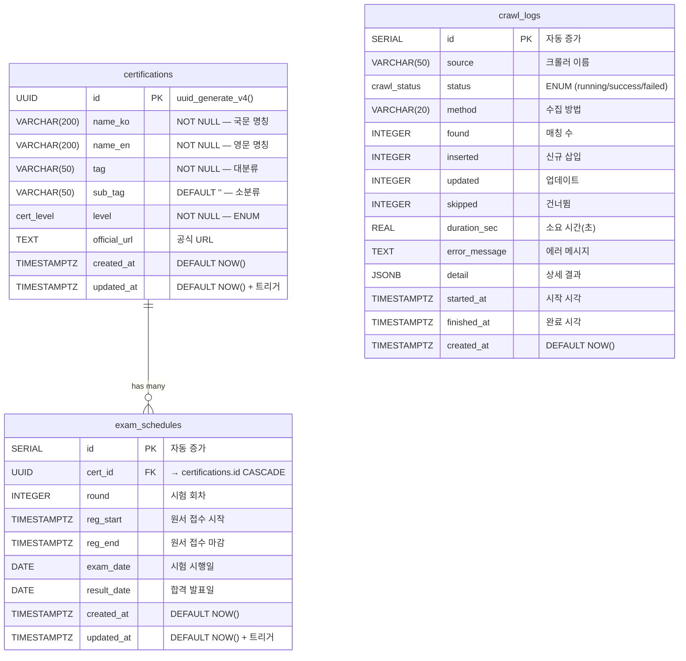

# 🗄️ 데이터베이스 스키마 (Database Schema)

> Certi-Hub의 PostgreSQL 데이터베이스 구조와 ERD를 정리합니다.
>
> 📍 초기화 스크립트: `database/init.sql` | ORM 모델: `backend/models.py`

---

## 📊 ERD (Entity-Relationship Diagram)



---

## 📋 테이블 상세

### 1. `certifications` — 자격증 마스터

IT 자격증의 기본 정보를 저장하는 마스터 테이블입니다.

| 컬럼 | 타입 | 제약 | 설명 |
|------|------|------|------|
| `id` | `UUID` | PK, DEFAULT `uuid_generate_v4()` | 자격증 고유 식별자 |
| `name_ko` | `VARCHAR(200)` | NOT NULL | 국문 명칭 (예: "정보처리기사") |
| `name_en` | `VARCHAR(200)` | NOT NULL | 영문 명칭 (예: "Engineer Information Processing") |
| `tag` | `VARCHAR(50)` | NOT NULL | 대분류 태그 (예: Cloud, AI, 데이터, 보안) |
| `sub_tag` | `VARCHAR(50)` | DEFAULT `''` | 소분류 (예: Amazon, Google, Microsoft) |
| `level` | `cert_level` (ENUM) | NOT NULL | 자격증 레벨 |
| `official_url` | `TEXT` | NULLABLE | 공식 접수/정보 페이지 URL |
| `created_at` | `TIMESTAMPTZ` | DEFAULT `NOW()` | 레코드 생성 시각 |
| `updated_at` | `TIMESTAMPTZ` | DEFAULT `NOW()` + 트리거 | 마지막 수정 시각 (자동 갱신) |

**인덱스**

| 인덱스 이름 | 대상 컬럼 | 용도 |
|-------------|-----------|------|
| `ix_cert_tag` | `tag` | 카테고리별 필터링 성능 |
| `ix_cert_level` | `level` | 레벨별 필터링 성능 |
| `ix_cert_name_ko` | `name_ko` | 한글 이름 검색 성능 |

---

### 2. `exam_schedules` — 시험 일정

자격증별 시험 일정(회차, 접수 기간, 시험일, 발표일)을 저장합니다.

| 컬럼 | 타입 | 제약 | 설명 |
|------|------|------|------|
| `id` | `SERIAL` | PK, 자동 증가 | 일정 고유 ID |
| `cert_id` | `UUID` | FK → `certifications.id` ON DELETE CASCADE | 소속 자격증 |
| `round` | `INTEGER` | NULLABLE | 시험 회차 (예: 55회) |
| `reg_start` | `TIMESTAMPTZ` | NULLABLE | 원서 접수 시작일 |
| `reg_end` | `TIMESTAMPTZ` | NULLABLE | 원서 접수 마감일 |
| `exam_date` | `DATE` | NULLABLE | 시험 시행일 |
| `result_date` | `DATE` | NULLABLE | 합격자 발표일 |
| `created_at` | `TIMESTAMPTZ` | DEFAULT `NOW()` | 레코드 생성 시각 |
| `updated_at` | `TIMESTAMPTZ` | DEFAULT `NOW()` + 트리거 | 마지막 수정 시각 (자동 갱신) |

**인덱스**

| 인덱스 이름 | 대상 컬럼 | 용도 |
|-------------|-----------|------|
| `ix_schedule_cert_id` | `cert_id` | 자격증별 일정 조회 |
| `ix_schedule_exam_date` | `exam_date` | 날짜 범위 검색 (캘린더) |

**CASCADE 삭제**: 자격증이 삭제되면 해당 시험 일정도 함께 삭제됩니다.

---

### 3. `crawl_logs` — 크롤링 실행 이력

크롤러 실행마다 한 줄씩 기록하여 상태/통계를 추적합니다.

| 컬럼 | 타입 | 제약 | 설명 |
|------|------|------|------|
| `id` | `SERIAL` | PK, 자동 증가 | 로그 고유 ID |
| `source` | `VARCHAR(50)` | NOT NULL | 크롤러 이름 |
| `status` | `crawl_status` (ENUM) | NOT NULL, DEFAULT `'running'` | 실행 상태 |
| `method` | `VARCHAR(20)` | NULLABLE | 데이터 수집 방법 |
| `found` | `INTEGER` | DEFAULT 0 | DB에서 매칭된 자격증 수 |
| `inserted` | `INTEGER` | DEFAULT 0 | 신규 삽입 건수 |
| `updated` | `INTEGER` | DEFAULT 0 | 업데이트 건수 |
| `skipped` | `INTEGER` | DEFAULT 0 | 건너뛴 건수 |
| `duration_sec` | `REAL` | NULLABLE | 실행 소요 시간 (초) |
| `error_message` | `TEXT` | NULLABLE | 실패 시 에러 메시지 |
| `detail` | `JSONB` | NULLABLE | 상세 결과 (JSON) |
| `started_at` | `TIMESTAMPTZ` | DEFAULT `NOW()` | 크롤링 시작 시각 |
| `finished_at` | `TIMESTAMPTZ` | NULLABLE | 크롤링 완료 시각 |
| `created_at` | `TIMESTAMPTZ` | DEFAULT `NOW()` | 레코드 생성 시각 |

**인덱스**

| 인덱스 이름 | 대상 컬럼 | 용도 |
|-------------|-----------|------|
| `ix_crawl_source` | `source` | 크롤러별 이력 조회 |
| `ix_crawl_status` | `status` | 상태별 필터링 |
| `ix_crawl_started_at` | `started_at` | 시간순 정렬 |

---

## 🔖 ENUM 타입

### `cert_level` — 자격증 레벨

| 값 | 한국어 표기 | 설명 |
|----|------------|------|
| `Basic` | 초급 | 입문/기초 수준 (예: AWS Cloud Practitioner, AZ-900) |
| `Intermediate` | 중급 | 실무자 수준 (예: AWS SAA, AZ-104) |
| `Advanced` | 상급 | 전문가 수준 (예: AWS SAP, 정보처리기사) |
| `Master` | 고급 | 최상위 수준 (예: CISSP, CISA) |

### `crawl_status` — 크롤링 상태

| 값 | 설명 |
|----|------|
| `running` | 크롤링 실행 중 |
| `success` | 크롤링 성공 |
| `failed` | 크롤링 실패 |

---

## ⚡ 트리거

### `update_updated_at_column()` — 자동 시간 갱신

`certifications`와 `exam_schedules` 테이블의 `updated_at` 컬럼은 행이 UPDATE될 때 자동으로 현재 시각(`NOW()`)으로 갱신됩니다.

```sql
CREATE OR REPLACE FUNCTION update_updated_at_column()
RETURNS TRIGGER AS $$
BEGIN
    NEW.updated_at = NOW();
    RETURN NEW;
END;
$$ LANGUAGE plpgsql;

-- certifications 테이블
CREATE OR REPLACE TRIGGER tr_cert_updated_at
    BEFORE UPDATE ON certifications
    FOR EACH ROW
    EXECUTE FUNCTION update_updated_at_column();

-- exam_schedules 테이블
CREATE OR REPLACE TRIGGER tr_schedule_updated_at
    BEFORE UPDATE ON exam_schedules
    FOR EACH ROW
    EXECUTE FUNCTION update_updated_at_column();
```

---

## 🔗 Relationship (ORM)

SQLAlchemy ORM에서의 관계 매핑:

```python
# Certification → ExamSchedule (1:N)
class Certification(Base):
    schedules = relationship(
        "ExamSchedule",
        back_populates="certification",
        cascade="all, delete-orphan"
    )

class ExamSchedule(Base):
    certification = relationship(
        "Certification",
        back_populates="schedules"
    )
```

- **`cascade="all, delete-orphan"`**: 부모(Certification) 삭제 시 자식(ExamSchedule) 레코드도 모두 삭제
- **back_populates**: 양방향 관계 설정으로 `cert.schedules` ↔ `schedule.certification` 양쪽 접근 가능

---

## 🔧 확장 모듈

```sql
CREATE EXTENSION IF NOT EXISTS "uuid-ossp";
```

- **uuid-ossp**: `uuid_generate_v4()` 함수를 제공하여 UUID v4 기본값 생성에 사용

---

## 📁 관련 파일

| 파일 | 설명 |
|------|------|
| `database/init.sql` | DDL 스크립트 (테이블, 인덱스, 트리거, ENUM 생성) |
| `database/seed.sql` | 초기 시드 데이터 (130+ 자격증 마스터) |
| `backend/models.py` | SQLAlchemy ORM 모델 정의 |
| `backend/database.py` | DB 엔진 및 세션 팩토리 설정 |
| `backend/config.py` | DB 연결 문자열 환경변수 관리 |
| `scripts/backup-db.sh` | PostgreSQL 백업 스크립트 |

---

## 🔄 마이그레이션 가이드

현재 스키마 변경은 `init.sql`에서 `CREATE TABLE IF NOT EXISTS`로 관리합니다.

### 스키마 변경 시 절차

1. `database/init.sql` 수정
2. `backend/models.py` ORM 모델 동기화
3. 개발 환경에서 테스트:
   ```bash
   # DB 볼륨 삭제 후 재생성
   docker compose down -v
   docker compose up -d
   ```
4. 프로덕션에서는 직접 ALTER TABLE 실행:
   ```sql
   -- 예: 컬럼 추가
   ALTER TABLE certifications ADD COLUMN description TEXT;
   ```

> 💡 **향후 개선**: Alembic 마이그레이션 도구 도입을 검토할 수 있습니다.

---

## 🔗 관련 문서

| 문서 | 설명 |
|------|------|
| [서비스 개요](./service-overview.md) | 서비스 소개 |
| [아키텍처](./architecture.md) | 시스템 구조 |
| [API 명세](./api-reference.md) | REST API 엔드포인트 |
| [크롤러 시스템](./crawler-system.md) | 크롤러 운영 가이드 |
