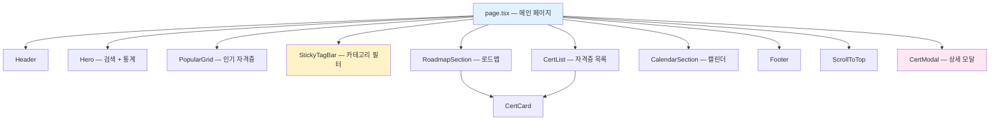
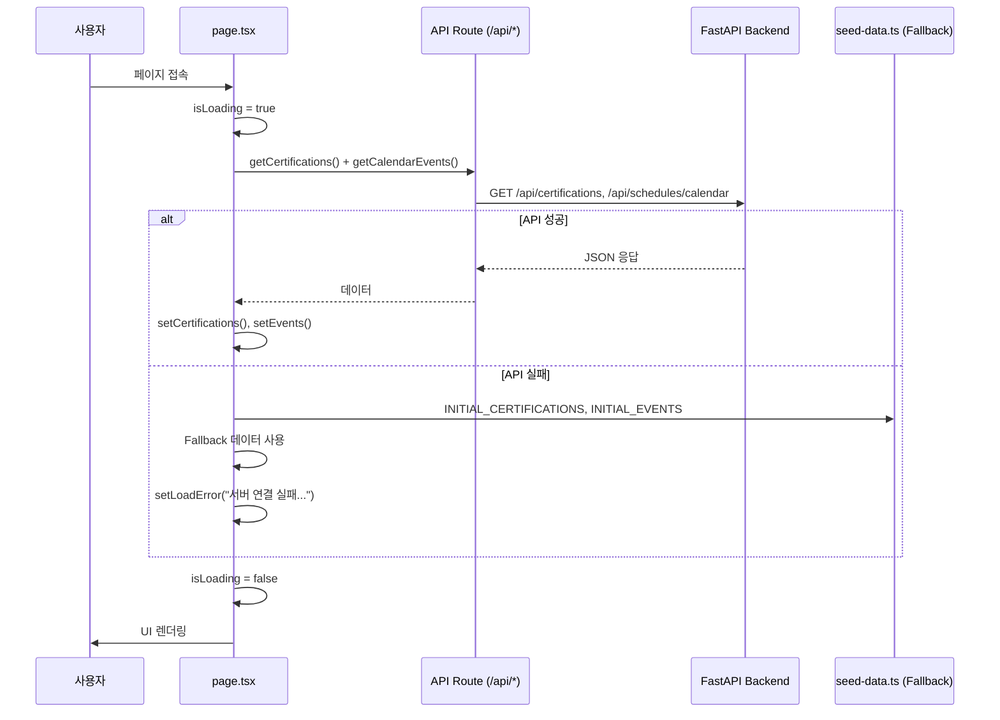

# 🎨 프론트엔드 가이드 (Frontend Guide)

> Certi-Hub Next.js 프론트엔드의 구조, 컴포넌트, 상태 관리, 스타일링을 정리합니다.
>
> 📍 소스 위치: `frontend/`

---

## 📁 프로젝트 구조

```
frontend/
├── app/                        # Next.js App Router
│   ├── layout.tsx              # 루트 레이아웃 (HTML/body, 폰트, 메타)
│   ├── page.tsx                # 메인 페이지 (모든 컴포넌트 오케스트레이션)
│   ├── globals.css             # 전역 CSS (Tailwind + 커스텀)
│   ├── api/                    # API Route Handlers (서버사이드 프록시)
│   │   ├── certifications/
│   │   │   └── route.ts        # /api/certifications → 백엔드 프록시
│   │   └── schedules/
│   │       └── route.ts        # /api/schedules → 백엔드 프록시
│   └── components/             # UI 컴포넌트
│       ├── Header.tsx          # 상단 네비게이션
│       ├── Hero.tsx            # 히어로 섹션 (검색 + 통계)
│       ├── StickyTagBar.tsx    # 카테고리 필터 (스크롤 고정)
│       ├── PopularGrid.tsx     # 인기 자격증 그리드
│       ├── RoadmapSection.tsx  # 로드맵 (테이블/카드 뷰)
│       ├── CertList.tsx        # 자격증 리스트 뷰
│       ├── CertCard.tsx        # 자격증 카드 컴포넌트
│       ├── CertModal.tsx       # 자격증 상세 모달
│       ├── CalendarSection.tsx # 캘린더 (FullCalendar)
│       ├── Footer.tsx          # 푸터
│       ├── ScrollToTop.tsx     # 스크롤 맨 위로 버튼
│       ├── ErrorBoundary.tsx   # 에러 경계 컴포넌트
│       └── LoadingSkeleton.tsx # 로딩 스켈레톤
├── lib/                        # 유틸리티 & 데이터
│   ├── api.ts                  # Axios API 클라이언트
│   ├── types.ts                # TypeScript 타입 정의
│   ├── constants.ts            # 상수 (태그 스타일, 레벨 라벨 등)
│   ├── seed-data.ts            # 정적 자격증 데이터 (Fallback)
│   └── seed-events.ts          # 정적 캘린더 이벤트 (Fallback, 자동 동기화)
├── public/                     # 정적 파일
├── next.config.js              # Next.js 설정
├── tailwind.config.ts          # Tailwind CSS 설정
├── tsconfig.json               # TypeScript 설정
├── package.json                # 의존성
├── Dockerfile                  # 개발용 Docker 이미지
└── Dockerfile.prod             # 프로덕션 Docker 이미지 (standalone)
```

---

## 🧩 컴포넌트 아키텍처



---

## 📦 컴포넌트 상세

### `page.tsx` — 메인 페이지 (오케스트레이터)

전체 애플리케이션의 상태와 데이터 흐름을 관리하는 최상위 컴포넌트입니다.

**주요 상태**

| 상태 | 타입 | 설명 |
|------|------|------|
| `certifications` | `Certification[]` | 전체 자격증 목록 |
| `events` | `CalendarEvent[]` | 캘린더 이벤트 |
| `selectedCert` | `Certification \| null` | 모달에 표시할 자격증 |
| `isLoading` | `boolean` | 초기 로딩 상태 |
| `activeTag` | `string` | 현재 선택된 카테고리 필터 |
| `searchQuery` | `string` | 검색어 |
| `loadError` | `string \| null` | API 에러 메시지 |

**데이터 로딩 흐름 (Fallback)**

```
1순위: 백엔드 API (DB에서 최신 데이터)
    ↓ 실패 시
2순위: 정적 seed-data (seed-data.ts + seed-events.ts)
```

**검색 처리**: React 상태 기반 (`useMemo` + `useCallback`)으로 DOM 조작 없이 선언적으로 필터링

---

### `Header.tsx` — 상단 네비게이션

고정 헤더로 로고, 네비게이션 링크, 모바일 메뉴를 포함합니다.

- **위치**: `fixed top-0`, `z-[1000]`
- **반응형**: 데스크톱은 전체 메뉴, 모바일은 햄버거 메뉴

---

### `Hero.tsx` — 히어로 섹션

검색 바와 서비스 통계를 표시합니다.

**주요 기능**
- **실시간 검색**: 입력과 동시에 자격증 자동완성 드롭다운 표시
- **통계**: 총 자격증 수, 분야 수 등
- **드롭다운**: 최대 12건 표시, `max-h-[400px]` 스크롤
- **오버플로 처리**: 글로우 배경에만 `overflow-hidden` 적용 (드롭다운이 섹션 밖으로 나올 수 있도록)

---

### `StickyTagBar.tsx` — 카테고리 필터 (스크롤 고정)

스크롤 시에도 화면 상단에 고정되는 카테고리 필터 바입니다.

**주요 특징**
- **Sticky 포지션**: `sticky top-14 sm:top-16 z-[900]`
- **반투명 배경**: `bg-white/95 backdrop-blur-md`
- **카테고리 버튼**: "전체" + 14개 태그 (각 태그별 자격증 수 표시)
- **가로 스크롤**: `overflow-x-auto` + `scrollbar-hide`
- **활성 상태**: 선택된 태그는 `bg-primary text-white` 스타일

---

### `PopularGrid.tsx` — 인기 자격증 그리드

분야별로 대표 자격증을 그리드 형태로 보여줍니다.

---

### `RoadmapSection.tsx` — 로드맵

레벨별 자격증 취득 경로를 시각화합니다.

**뷰 모드**
- **테이블 뷰**: 레벨별 컬럼으로 자격증 배치
- **카드 뷰**: 반응형 카드 레이아웃

**필터 연동**: `activeTag` 상태에 따라 해당 카테고리의 자격증만 표시

---

### `CertCard.tsx` — 자격증 카드

개별 자격증 정보를 카드 형태로 표시합니다.

| 표시 정보 | 설명 |
|-----------|------|
| 태그 아이콘 + 이름 | Font Awesome 아이콘 + 대분류 태그 |
| 국문/영문 명칭 | 자격증 이름 |
| 레벨 뱃지 | 초급~고급 색상 구분 |
| 공식 URL 링크 | 클릭 시 외부 페이지 새 탭 |

---

### `CertModal.tsx` — 자격증 상세 모달

자격증을 클릭하면 나타나는 상세 정보 모달입니다.

**주요 기능**
- 자격증 상세 정보 (이름, 태그, 레벨, URL)
- 관련 시험 일정 표시 (접수 기간, 시험일, 발표일)
- 동일 분야/레벨 자격증 추천
- ESC 키 또는 백그라운드 클릭으로 닫기

---

### `CalendarSection.tsx` — 캘린더

FullCalendar를 활용한 시험 일정 캘린더입니다.

**뷰 모드**
- **월별 뷰** (`dayGridMonth`): 달력 형태로 일정 표시
- **리스트 뷰** (`listMonth`): 리스트 형태로 일정 나열

**이벤트 색상 코딩**

| 이벤트 유형 | 색상 | 의미 |
|------------|------|------|
| `registration` | 🔵 `#93c5fd` (연파랑) | 원서 접수 기간 |
| `exam` | 🔴 `#ef4444` (빨강) | 시험 시행일 |
| `result` | 🟢 `#22c55e` (초록) | 합격 발표일 |

**필터 연동**: `activeTag` 상태에 따라 해당 카테고리의 일정만 캘린더에 표시

---

### `ErrorBoundary.tsx` — 에러 경계

각 섹션을 감싸서 개별 섹션 에러가 전체 페이지를 크래시시키지 않도록 합니다.

```tsx
<ErrorBoundary>
  <CalendarSection ... />
</ErrorBoundary>
```

---

### `LoadingSkeleton.tsx` — 로딩 스켈레톤

초기 데이터 로딩 중 표시되는 풀페이지 스켈레톤 UI입니다.

---

### `ScrollToTop.tsx` — 스크롤 맨 위로

스크롤이 일정 이상 내려가면 나타나는 "맨 위로" 플로팅 버튼입니다.

---

## 🔄 데이터 흐름



---

## 🎨 스타일링

### Tailwind CSS

모든 스타일링은 Tailwind CSS 유틸리티 클래스를 사용합니다.

**주요 디자인 토큰**

| 토큰 | 값 | 용도 |
|------|----|----|
| `primary` | 커스텀 색상 | 메인 브랜드 컬러 |
| `z-[1000]` | Header | 최상위 레이어 |
| `z-[999]` | 에러 배너 | Header 바로 아래 |
| `z-[900]` | StickyTagBar | 스크롤 고정 필터 |

### 반응형 디자인

| 브레이크포인트 | 크기 | 설명 |
|---------------|------|------|
| `sm` | 640px | 모바일 → 태블릿 |
| `md` | 768px | 태블릿 |
| `lg` | 1024px | 데스크톱 |
| `xl` | 1280px | 와이드 데스크톱 |

### TAG_STYLES (태그별 색상)

`lib/constants.ts`에 정의된 14개 카테고리의 스타일:

| 태그 | 배경색 | 글자색 | 아이콘 |
|------|--------|--------|--------|
| Cloud | `#dbeafe` | `#1e40af` | `faCloud` |
| 네트워크 | `#cffafe` | `#0e7490` | `faNetworkWired` |
| 데이터 | `#d1fae5` | `#065f46` | `faDatabase` |
| 서버/DB | `#fef3c7` | `#92400e` | `faServer` |
| 아키텍처 | `#ede9fe` | `#5b21b6` | `faSitemap` |
| 보안 | `#fee2e2` | `#991b1b` | `faShieldHalved` |
| AI | `#fce7f3` | `#9d174d` | `faBrain` |
| Project Managing | `#ffedd5` | `#9a3412` | `faDiagramProject` |
| QA | `#ccfbf1` | `#134e4a` | `faClipboardCheck` |
| Infra | `#e0e7ff` | `#3730a3` | `faBuilding` |
| UX/UI | `#fae8ff` | `#86198f` | `faPalette` |
| 감사 | `#f5f5f4` | `#44403c` | `faMagnifyingGlassChart` |
| Solution | `#e0f2fe` | `#0369a1` | `faPuzzlePiece` |
| 금융/기타 | `#fef9c3` | `#854d0e` | `faCoins` |

---

## 📡 API 통신

### API 클라이언트 (`lib/api.ts`)

Axios 기반 HTTP 클라이언트로, 백엔드 API와 통신합니다.

```typescript
// 상대 경로 사용 — Next.js API Route를 통해 프록시
const api = axios.create({
  baseURL: "/api",
  timeout: 10000,
});
```

**인터셉터**: 요청 실패 시 자동 재시도, 에러 로깅

### API Route Handlers

Next.js 서버사이드 API 라우트로, 프론트엔드에서 백엔드로의 프록시 역할을 합니다.

| 라우트 | 백엔드 대상 |
|--------|------------|
| `/api/certifications` | `http://backend:8000/api/certifications` |
| `/api/schedules` | `http://backend:8000/api/schedules` |

> ⚠️ `export const dynamic = 'force-dynamic'` — `request.url` 사용으로 정적 생성 불가, 동적 렌더링 강제

---

## 📐 TypeScript 타입 (`lib/types.ts`)

### 주요 인터페이스

```typescript
// 자격증
interface Certification {
  id: string;           // UUID
  name_ko: string;      // 국문 명칭
  name_en: string;      // 영문 명칭
  tag: string;          // 대분류
  sub_tag: string;      // 소분류
  level: CertLevel;     // Basic | Intermediate | Advanced | Master
  official_url?: string;
}

// 캘린더 이벤트
interface CalendarEvent {
  title: string;
  start: string;
  end?: string;
  color: string;
  textColor?: string;
  type?: "registration" | "exam" | "result";
  cert_id?: string;
}

// 페이지네이션 응답
interface PaginatedResponse<T> {
  items: T[];
  total: number;
  page: number;
  size: number;
}
```

---

## 🐳 Docker 빌드

### 개발용 (`Dockerfile`)

```dockerfile
FROM node:20-alpine
WORKDIR /app
COPY package*.json ./
RUN npm install
COPY . .
CMD ["npm", "run", "dev"]
```

### 프로덕션용 (`Dockerfile.prod`)

3단계 멀티 스테이지 빌드:

| 스테이지 | 역할 | 설명 |
|----------|------|------|
| `deps` | 의존성 설치 | `npm ci` (devDependencies 포함) |
| `builder` | 빌드 | `npm run build` → standalone 출력 |
| `runner` | 런타임 | Node.js + standalone 출력물만 (최소 이미지) |

**핵심 설정**: `next.config.js`에서 `output: "standalone"` 필수

---

## ⚙️ Next.js 설정 (`next.config.js`)

```javascript
module.exports = {
  output: "standalone",  // Docker 프로덕션 빌드용
  // rewrites는 제거됨 — API Route Handler가 프록시 역할
};
```

---

## 🔗 관련 문서

| 문서 | 설명 |
|------|------|
| [서비스 개요](./service-overview.md) | 서비스 소개 |
| [아키텍처](./architecture.md) | 시스템 구조 |
| [기술 스택](./tech-stack.md) | 사용 기술 |
| [API 명세](./api-reference.md) | REST API 엔드포인트 |
| [데이터베이스 스키마](./database-schema.md) | 테이블 구조 |
| [크롤러 시스템](./crawler-system.md) | 크롤러 운영 가이드 |
| [배포 가이드](./deployment-guide.md) | 배포 및 운영 |
